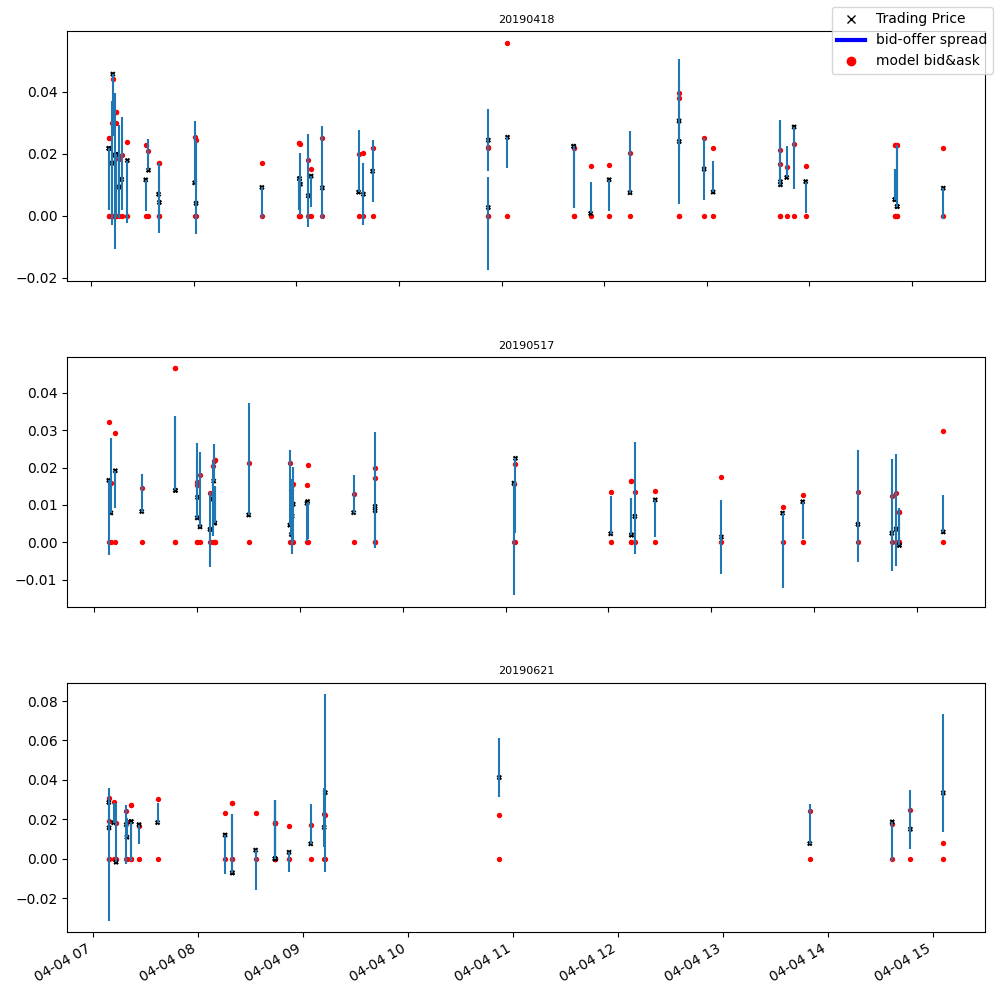
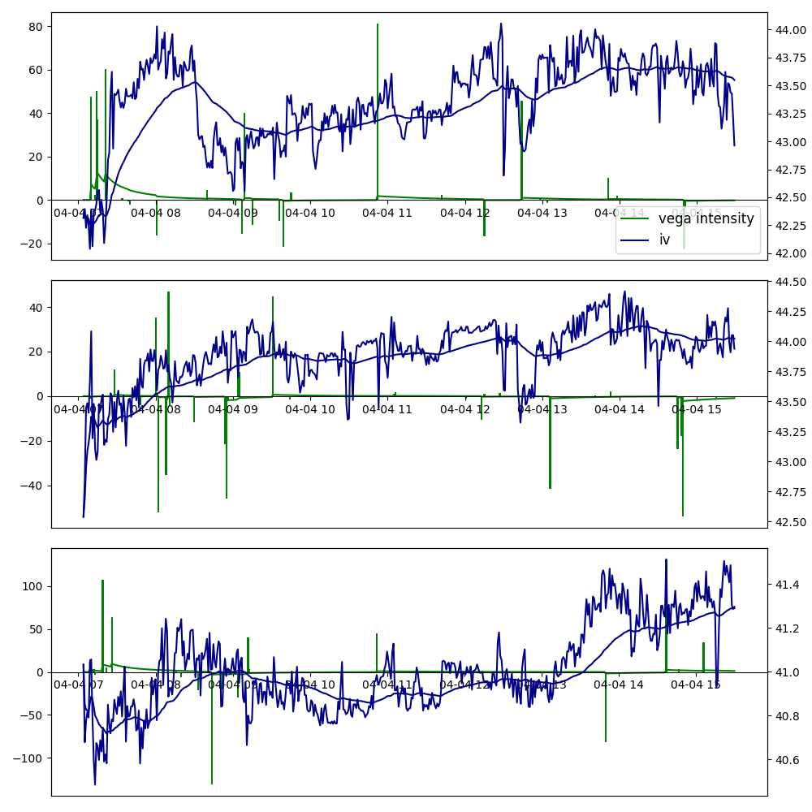
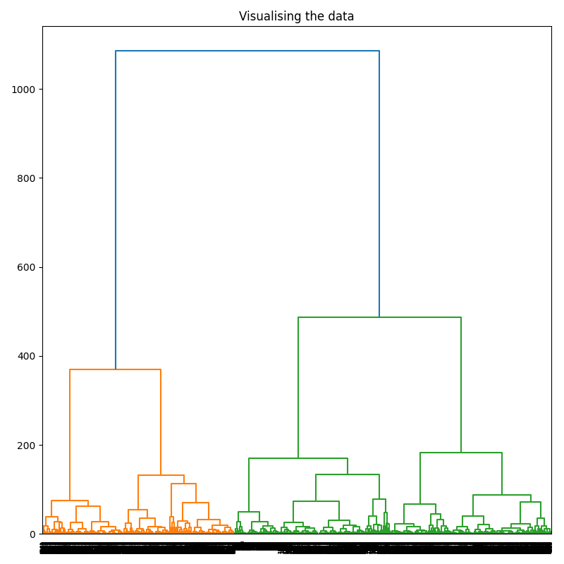
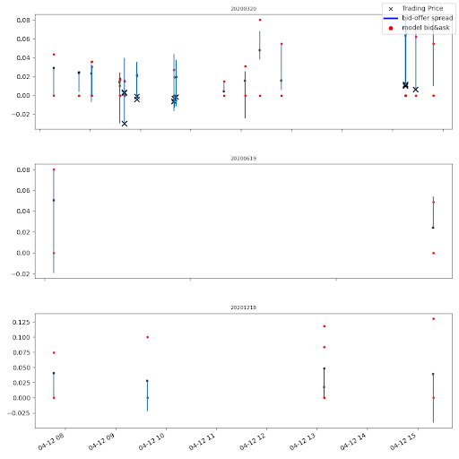

# Trades Dynamics (requires Deutsche Boerse A7 access)
## Get a sense of what's driving the equity options market ##

### Abstract : ###
It is easy to miss new price-relevant information when trading Equity Options.
Trade patterns can alert traders that market assumptions are shifting.
They can also inform on the arrival of large orders in an illiquid market.
This project aims to detect trading patterns in order to allow traders to get an idea of what's going on.

One important aspect of a trade analysis is to spot the "interest" side of the trade. Whether the aggressor was the buyer or the seller, it doesn't tell us who was actually crossing the spread to make the trade happen. 
To figure that out, we will first calibrate a volatility surface in order to get a theoretical bid and ask price, undisturbed by local (ie. strike specific) microstructure action. 

We will then calculate an "aggressivity" indicator, defined as follows :

aggressivity = min(1, max(-1, (traded_price - mid_theo_price) / half_theo_spread))

NB : The aggressivity is negative for selling interest and positive for buying ones.

This indicator will then be used in conjunction with the vega of the trade to determine the "intensity" of each trade.
It is defined as :

intensity = vega * aggressivity

Indeed, interesting trades are the ones with a large vega and a clear side.

This metric, among others, will then be used to identify clusters of similar trades. These clusters will in turn be sorted by intensity in order to show the most remarkable trade actions in the period.

### How to proceed : ###

In order to run this project, you need a Deutsche Boerse A7 subscription to access intraday data and then fit a volatility surface for each timestamp.
For that, please refer to the preliminary git :
https://github.com/a7/Calibrating-implicit-volatility-surface-with-Deutsche-Boerse-A7

Running this git is a pre-requisite as it will generate a data file containing a volatility surface :Params_xxx.pkl where xxx is the code of the calibrated underlying (such as 'ALV' for Allianz).
This pickle file must be placed in a folder referenced in the SetUp.py file (see below)

You will also need a Python 3.8 or above interpreter with the following packages :
- QuantLib
- numpy, pandas
- math, datetime, matplotlib
- sklearn, scipy
- requests, warnings

You will also need to download the python files provided in this git :
DateAndTime.py, PricingAndCalibration.py, Clustering.py, TradeFlesh.py, SetUp.py

Here are the kind of graph that you can generate. (More details in the Jupyter Notebook)

Aggressivity Rating

Trades Dynamics

Clustering Algo

Selected Trades

_Written by canari.dev (www.canari.dev)_
